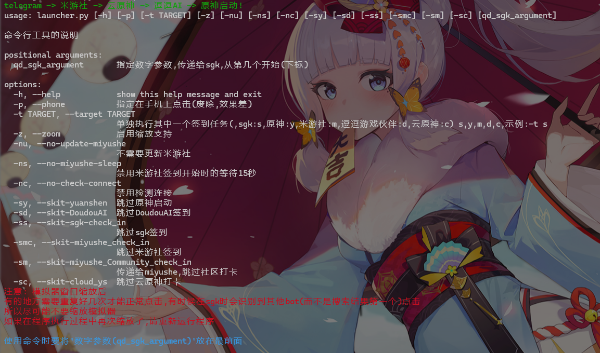
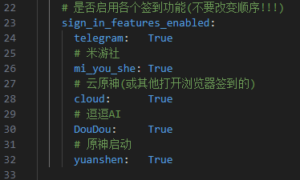

<!--
 * @encode: utf-8
 * @Date: 2025-01-09 18:18:07
 * @LastEditTime: 2025-01-20 19:44:04
 * @FilePath: /qd/README.md
-->
# 使用须知
- 本项目自带的功能有:telegram机器人签到,米游社各社区打卡,米游社原神社区签到福利,米游社每日的米游币获取,逗逗游戏伙伴每日签到,每日打开一个链接(如云原神签到),打开原神
- 本项目基于图形化界面,通过简单的模拟鼠标与键盘输入进行签到任务
- -h选项(帮助信息)截图:

- 注意:我这里使用的是逍遥模拟器模拟Android以运行米游社等程序,也可以换成其他的模拟器,只需要配置一下相应的adb的配置等即可
- 如果使用时指定`-z`选项,初始化中的步骤3可以省略(但最好不要省略,理由在上面的截图)
- 项目代码质量不太好,可能在使用过程中会出现问题
- 如果移动项目,需要在项目下重新运行`python init_project.py`生成bat文件,或者手动修改bat文件与环境变量
- 环境变量与bat文件都在back文件夹中有备份

# 初始化
- 安装adb
- 安装magick(可选)
- `git clone https://github.com/tiandic/qd.git`
- `cd qd`
- `python init_project.py`
- 配置config.yaml文件
1. 按照 配置文件的提示配置,其中最后带有`###`的行是推测大概率会需要更改的
2. 在config.yaml将不需要的功能设置为False

3. 将各个文件夹下的图片替换为自己电脑上的,截图`(快捷键:Win+Shift+S)`即可(TEMP文件夹下的与自己不需要的功能的除外)
    ##### 替换图片示例视频:
<video controls>
    <source src="./README_config/Configuration_picture_example.mp4" type="video/mp4">
    您的浏览器不支持 video 标签。
</video>

- 然后就可以在命令行里使用`qd`命令了!
- 如:`qd -h`

# 使用说明
- 直接使用 `qd` 命令会直接开始按预定顺序执行签到任务
- 指定参数便按照参数指定的运行

# 扩展本项目
- 本项目的关键文件是tool.py文件
- 使用者可以通过调用tool.py的各个函数扩展或者创建自己的`qd`项目
## 以下为tool.py各个函数及变量的说明及使用示例

### 简略说明:
    tool.py 拥有在屏幕上寻找图像,点击屏幕上指定的图像,在执行签到任务时暂停等功能
- click_image:                      (核心函数)指定一个图片路径,然后它会在屏幕上寻找并点击(只寻找一次,没找到时会抛出错误)(一般用于尝试点击)
- click_image2:                     (核心函数)功能同上,不同的是它会不断在屏幕上寻找并点击,直到找到为止(不会抛出错误)
### 详细说明:
#### 变量:
- config_data: 储存了config.yam中的配置信息,在__init__.py中初始化
- current_script_path: tool.py所在的绝对路径
- current_dir: 过渡用的,没什么用,是tool.py所在的目录的绝对路径
- start_path: 项目的绝对路径
- lastClickedImage: 在进行签到任务中,上一张点击的图片,用于回溯,即当过长时间没有找到需要点击的图片的位置时,会尝试寻找上次点击的图片位置进行点击(当上次点击没点到时会触发)
- global_scale_factor: 缩放比例 当指定-z参数时才会用到,公式为: 新图片=老图片*global_scale_factor
- paused: 用于程序运行时的暂停,每次寻找图片点击时(即执行前缀为click_image的函数时)会检查该变量是否设置为True,如果为True则进入暂停状态

#### 函数:
- scale_image与scale_image2:        都是对图像进行缩放的函数,指定-z参数才会用到
- get_Android_resize_ratio:         用于自动计算Android模拟器大小与之前的比例,指定-z参数才会用到
- find_image_on_screen:             寻找指定图像的位置,并按照参数返回图像在屏幕上的中心坐标(错误发生时,会抛出错误)
- click_image:                      (核心函数)指定一个图片路径,然后它会在屏幕上寻找并点击(只寻找一次,没找到时会抛出错误)(一般用于尝试点击)
- click_image2:                     (核心函数)功能同上,不同的是它会不断在屏幕上寻找并点击,直到找到为止(不会抛出错误)
- click_image_with_backup_methods:  (用于辅助)辅助click_image2函数点击,当click_image2每次在屏幕上寻找并点击失败时,会调用它来尝试寻找并点击
- get_exe_size:                     获取指定窗口的大小
- resize_images_in_directory        批量缩放指定目录中的图像文件，并将它们保存到新的目录,返回缩放后的文件夹路径.(只有指定-z参数时才会用到)
- toggle_pause:                     切换暂停状态的函数
- if_need_pause:                    判断是否需要暂停(每次寻找图片点击时(即执行前缀为click_image的函数时)会调用它来检查paused变量)
- get_active_window_position:       获取当前活动窗口的中心坐标
### 使用示例
在项目的任意位置创建文件,
如:在项目的根目录创建my_qd.py
```python
# my_qd.py
from .tool import tool

# 在屏幕上获取图像"p.png"的位置
# 如果有多个位置则获取最高点的那个
p_x_y=tool.find_image_on_screen("p.png")
# 获取屏幕上所有图像"p.png"的位置
p_all=tool.find_image_on_screen("p.png",match_boundary="all")

# 当图像"p.png"出现在屏幕上时,鼠标左键点一下它,然后继续执行
tool.click_image2("p.png")
# 看看屏幕上有没有图像"p.png",如果有,就左键点击,没有,则抛出错误
tool.click_image("p.png")

```
运行:
    在项目的上级目录,使用如下命令,以运行模块的方式运行

    python -m qd.my_qd

## 关于日志
日志在项目的log文件夹下
其中有一个`qd_click_image_debug.log`文件较为特殊,它储存的上关于那些以click_image为前缀的函数的日志,记录的错误很少用到,因为项目的except语句下的处理并不全是用于捕获错误信息,而是正常代码的一部分 而`qd_click_image_debug.log`就是专门储存except语句下有正常代码的错误信息的